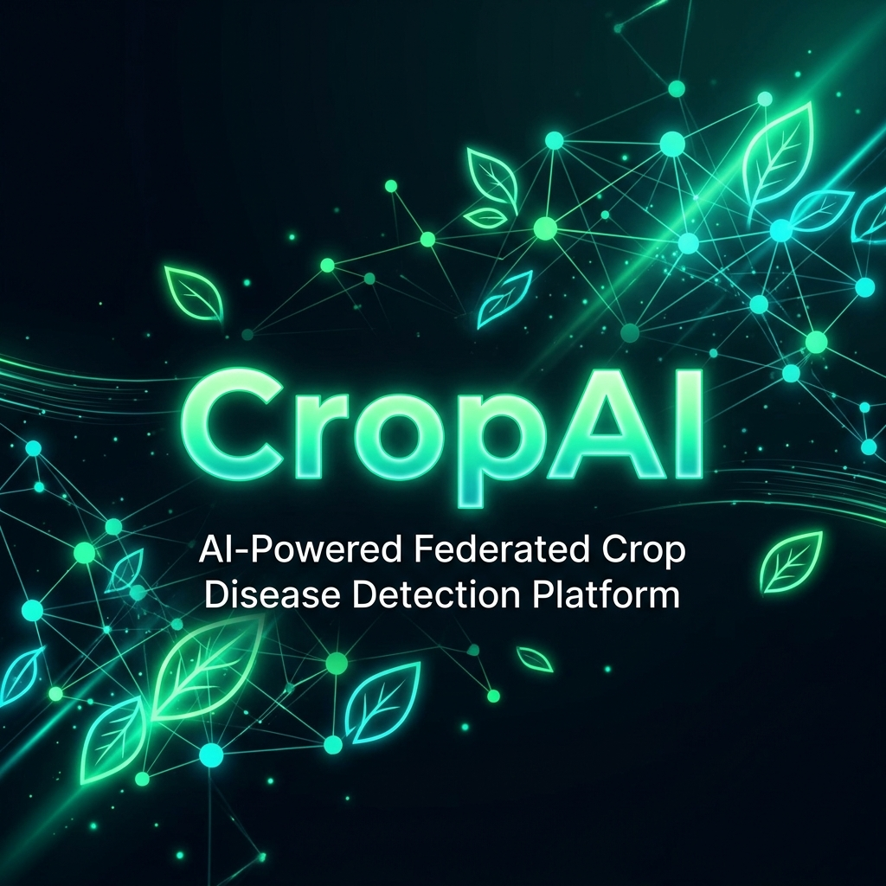

<div align="center">



# 🌿 CropAI

### AI-Powered Federated Crop Disease Detection Platform

[](https://react.dev/)
[](https://nodejs.org/)
[](https://supabase.com/)
[](https://www.tensorflow.org/js)
[](https://ai.google.dev/)
[](LICENSE)

**Detect crop diseases in seconds. Get AI-powered treatment plans. Connect with agricultural experts.**

[🚀 Live Demo](#) · [📋 Report Bug](https://github.com/Gwsaikat/CropAI/issues) · [✨ Request Feature](https://github.com/Gwsaikat/CropAI/issues)

</div>

---

## 📖 Table of Contents

- [✨ Features](#-features)
- [🏗️ Architecture](#️-architecture)
- [🛠️ Tech Stack](#️-tech-stack)
- [📁 Project Structure](#-project-structure)
- [⚙️ Setup & Installation](#️-setup--installation)
  - [Prerequisites](#prerequisites)
  - [1 · Clone the Repository](#1--clone-the-repository)
  - [2 · Configure the Server](#2--configure-the-server)
  - [3 · Configure the Client](#3--configure-the-client)
  - [4 · Install Dependencies](#4--install-dependencies)
  - [5 · Run the Application](#5--run-the-application)
- [🔑 Environment Variables](#-environment-variables)
- [📡 API Reference](#-api-reference)
- [🤝 Contributing](#-contributing)
- [📄 License](#-license)

---

## ✨ Features

| Feature | Description |
|---|---|
| 🔍 **AI Disease Detection** | Upload a leaf photo → TensorFlow.js model identifies diseases in-browser |
| 🧠 **Federated Learning** | Crowd-sourced model updates across farmer networks, preserving privacy |
| 💊 **Smart Remedies** | Gemini AI generates detailed, localized treatment plans |
| 📊 **Insights Dashboard** | Real-time analytics, charts, and regional disease heatmaps |
| 🗺️ **Geo-Location Mapping** | Leaflet maps showing disease outbreaks by location |
| 🌤️ **Weather Integration** | Live weather data tied to crop health recommendations |
| 👨‍🌾 **Expert Connect** | Chat directly with agricultural domain experts |
| 🔒 **Secure Auth** | Supabase-powered JWT authentication with protected routes |
| ⚡ **Real-Time Updates** | Socket.io for live federated model round broadcasts |

---

## 🏗️ Architecture

```
┌─────────────────────────────────────────────────────────────────┐
│                         CropAI Platform                         │
├──────────────────────────┬──────────────────────────────────────┤
│        CLIENT (React)    │           SERVER (Node.js)           │
│                          │                                      │
│  ┌────────────────────┐  │  ┌──────────────────────────────┐   │
│  │  TensorFlow.js     │  │  │  Express REST API            │   │
│  │  (In-browser ML)   │  │  │  /api/auth                   │   │
│  └────────────────────┘  │  │  /api/predict                │   │
│  ┌────────────────────┐  │  │  /api/remedies (Gemini AI)   │   │
│  │  React Pages       │  │  │  /api/insights               │   │
│  │  - Landing         │  │  │  /api/weather                │   │
│  │  - Detector        │  │  │  /api/expert                 │   │
│  │  - Dashboard       │  │  │  /api/federated              │   │
│  │  - Insights        │  │  └──────────────────────────────┘   │
│  │  - Remedies        │  │  ┌──────────────────────────────┐   │
│  │  - Expert          │  │  │  Socket.io (Real-time)       │   │
│  └────────────────────┘  │  │  Federated Model Rounds      │   │
│                          │  └──────────────────────────────┘   │
│                          │  ┌──────────────────────────────┐   │
│                          │  │  Supabase (PostgreSQL)        │   │
│                          │  │  Users · Predictions          │   │
│                          │  │  Experts · Federated Rounds   │   │
│                          │  └──────────────────────────────┘   │
└──────────────────────────┴──────────────────────────────────────┘
```

---

## 🛠️ Tech Stack

### Frontend (`/client`)
| Technology | Purpose |
|---|---|
| **React 19** | UI framework |
| **React Router v7** | Client-side routing |
| **TensorFlow.js** | In-browser crop disease ML model |
| **Supabase JS** | Auth & real-time DB client |
| **Chart.js + react-chartjs-2** | Analytics charts |
| **Leaflet + react-leaflet** | Interactive disease maps |
| **Socket.io Client** | Real-time federated updates |
| **React Markdown** | AI response rendering |
| **MUI (Material UI)** | UI component library |
| **Lucide React** | Icon library |

### Backend (`/server`)
| Technology | Purpose |
|---|---|
| **Node.js + Express** | REST API server |
| **Supabase** | PostgreSQL database & auth |
| **Socket.io** | Real-time WebSocket communication |
| **Google Gemini AI** | AI-generated treatment recommendations |
| **JWT (jsonwebtoken)** | Stateless authentication |
| **bcryptjs** | Password hashing |
| **Axios** | External API calls (weather) |
| **Multer** | Image upload handling |
| **Nodemon** | Development auto-restart |

---

## 📁 Project Structure

```
CropAI/
├── 📂 client/                    # React frontend
│   ├── 📂 public/                # Static assets
│   └── 📂 src/
│       ├── 📂 components/
│       │   └── Navbar.js         # Navigation bar
│       ├── 📂 context/
│       │   └── AuthContext.js    # Global auth state
│       ├── 📂 ml/
│       │   └── diseaseLabels.js  # ML model disease class labels
│       ├── 📂 pages/
│       │   ├── Landing.js        # Home / marketing page
│       │   ├── Login.js          # Login page
│       │   ├── Register.js       # Registration page
│       │   ├── Dashboard.js      # Farmer dashboard
│       │   ├── Detector.js       # AI disease detection
│       │   ├── Insights.js       # Analytics & maps
│       │   ├── Remedies.js       # AI treatment plans
│       │   └── Expert.js         # Expert consultation
│       ├── 📂 services/          # API service helpers
│       ├── 📂 lib/               # Utility functions
│       ├── App.js                # Router & route config
│       └── index.js              # Entry point
│
├── 📂 server/                    # Node.js backend
│   ├── 📂 config/
│   │   └── supabase.js           # Supabase client config
│   ├── 📂 middleware/
│   │   └── auth.js               # JWT middleware
│   ├── 📂 models/                # Data models
│   ├── 📂 routes/
│   │   ├── auth.js               # Auth endpoints
│   │   ├── predict.js            # Disease prediction
│   │   ├── remedies.js           # Gemini AI remedies
│   │   ├── insights.js           # Analytics data
│   │   ├── weather.js            # Weather API
│   │   ├── expert.js             # Expert system
│   │   └── federated.js          # Federated learning
│   ├── 📂 services/
│   │   └── ai.js                 # Gemini AI service
│   ├── 📂 scripts/
│   │   └── setupDB.js            # Database initialization
│   ├── .env.example              # Env variable template
│   └── server.js                 # Express app entry point
│
├── 📂 docs/                      # Documentation assets
├── .gitignore
├── package.json                  # Root convenience scripts
└── README.md
```

---

## ⚙️ Setup & Installation

### Prerequisites

Make sure you have the following installed:

| Tool | Version | Download |
|---|---|---|
| **Node.js** | v18+ | [nodejs.org](https://nodejs.org/) |
| **npm** | v9+ | Comes with Node.js |
| **Git** | Latest | [git-scm.com](https://git-scm.com/) |

You'll also need accounts for:
- 🗄️ **[Supabase](https://supabase.com)** — Free tier works perfectly
- 🤖 **[Google AI Studio](https://aistudio.google.com)** — Gemini API key
- 🌤️ **[OpenWeather API](https://openweathermap.org/api)** — Free tier (weather feature)

---

### 1 · Clone the Repository

```bash
git clone https://github.com/Gwsaikat/CropAI.git
cd CropAI
```

---

### 2 · Configure the Server

#### Step 2a — Create the server `.env` file

```bash
cd server
copy .env.example .env
```

> On macOS/Linux: `cp .env.example .env`

#### Step 2b — Fill in your credentials

Open `server/.env` in any text editor and fill in the values:

```env
PORT=5000
NODE_ENV=development
CLIENT_URL=http://localhost:3000

# ── Supabase ──────────────────────────────────────────────────
SUPABASE_URL=https://your-project-id.supabase.co
SUPABASE_SERVICE_KEY=your_supabase_service_role_key_here

# ── Authentication ────────────────────────────────────────────
JWT_SECRET=make_this_a_long_random_string_32chars_min

# ── Google Gemini AI ──────────────────────────────────────────
GEMINI_API_KEY=your_gemini_api_key_here

# ── Weather API ───────────────────────────────────────────────
WEATHER_API_KEY=your_openweather_api_key_here
```

#### Step 2c — Get your Supabase keys

> 1. Go to [supabase.com](https://supabase.com) → Create a new project
> 2. Navigate to **Project Settings → API**
> 3. Copy **Project URL** → `SUPABASE_URL`
> 4. Copy **service_role (secret)** key → `SUPABASE_SERVICE_KEY`

#### Step 2d — Initialize the Database (first time only)

```bash
# While inside /server directory
node scripts/setupDB.js
```

This creates all required tables in your Supabase project.

---

### 3 · Configure the Client

#### Step 3a — Create the client `.env` file

```bash
cd ../client
copy .env.example .env
```

> On macOS/Linux: `cp .env.example .env`

#### Step 3b — Fill in client credentials

Open `client/.env` and update:

```env
REACT_APP_API_URL=http://localhost:5000/api
REACT_APP_SUPABASE_URL=https://your-project-id.supabase.co
REACT_APP_SUPABASE_ANON_KEY=your_supabase_anon_key_here
```

> **Supabase Anon Key**: Same Settings page → copy the `anon (public)` key (NOT the service role key)

---

### 4 · Install Dependencies

You can install everything at once from the project root:

```bash
# From project root
cd ..

# Install client dependencies
cd client && npm install

# Install server dependencies
cd ../server && npm install
```

Or using the root convenience script:
```bash
# From project root
npm run install:all
```

---

### 5 · Run the Application

Open **two terminal windows** and run:

**Terminal 1 — Start the backend:**
```bash
cd server
npm run dev
```

You should see:
```
🚀 Server running on port 5000
📡 Environment: development
🌿 Federated Crop Disease Detector — Supabase Backend Ready
⚡ Supabase: ✅ Connected
```

**Terminal 2 — Start the frontend:**
```bash
cd client
npm start
```

The app will automatically open at **[http://localhost:3000](http://localhost:3000)** 🎉

---

## 🔑 Environment Variables

### Server (`server/.env`)

| Variable | Required | Description |
|---|---|---|
| `PORT` | ✅ | Server port (default: `5000`) |
| `NODE_ENV` | ✅ | `development` or `production` |
| `CLIENT_URL` | ✅ | Frontend URL for CORS |
| `SUPABASE_URL` | ✅ | Your Supabase project URL |
| `SUPABASE_SERVICE_KEY` | ✅ | Supabase service role secret key |
| `JWT_SECRET` | ✅ | Secret string for signing JWTs |
| `GEMINI_API_KEY` | ✅ | Google Gemini AI API key |
| `WEATHER_API_KEY` | ⚠️ | OpenWeather API key (optional) |

### Client (`client/.env`)

| Variable | Required | Description |
|---|---|---|
| `REACT_APP_API_URL` | ✅ | Backend API base URL |
| `REACT_APP_SUPABASE_URL` | ✅ | Supabase project URL |
| `REACT_APP_SUPABASE_ANON_KEY` | ✅ | Supabase public anon key |

> ⚠️ **Security Note**: Never commit `.env` files. They are in `.gitignore` by default. Only `.env.example` files are committed.

---

## 📡 API Reference

| Method | Endpoint | Auth | Description |
|---|---|---|---|
| `POST` | `/api/auth/register` | ❌ | Register a new farmer account |
| `POST` | `/api/auth/login` | ❌ | Login and receive JWT token |
| `GET` | `/api/auth/me` | ✅ | Get current logged-in user |
| `POST` | `/api/predict` | ✅ | Submit disease prediction data |
| `GET` | `/api/predict/history` | ✅ | Get user's prediction history |
| `POST` | `/api/remedies` | ✅ | Get AI treatment plan for a disease |
| `GET` | `/api/insights` | ✅ | Get regional disease analytics |
| `GET` | `/api/weather` | ✅ | Get weather data for a location |
| `GET` | `/api/expert` | ✅ | List available experts |
| `POST` | `/api/expert/message` | ✅ | Send message to an expert |
| `POST` | `/api/federated/submit` | ✅ | Submit federated model update |
| `GET` | `/api/health` | ❌ | Server health check |

---

## 🤝 Contributing

Contributions are welcome! Here's how:

1. **Fork** the repository
2. **Create** a feature branch: `git checkout -b feature/amazing-feature`
3. **Commit** your changes: `git commit -m 'feat: add amazing feature'`
4. **Push** to your branch: `git push origin feature/amazing-feature`
5. **Open** a Pull Request

Please follow conventional commit messages:
- `feat:` — New feature
- `fix:` — Bug fix
- `docs:` — Documentation update
- `refactor:` — Code refactoring
- `chore:` — Maintenance tasks

---

## 📄 License

This project is licensed under the **MIT License** — see the [LICENSE](LICENSE) file for details.

---

<div align="center">

**Made with 💚 for Farmers everywhere**

⭐ Star this repo if you find it useful!

[](https://github.com/Gwsaikat/CropAI/stargazers)
[](https://github.com/Gwsaikat/CropAI/network/members)

</div>
